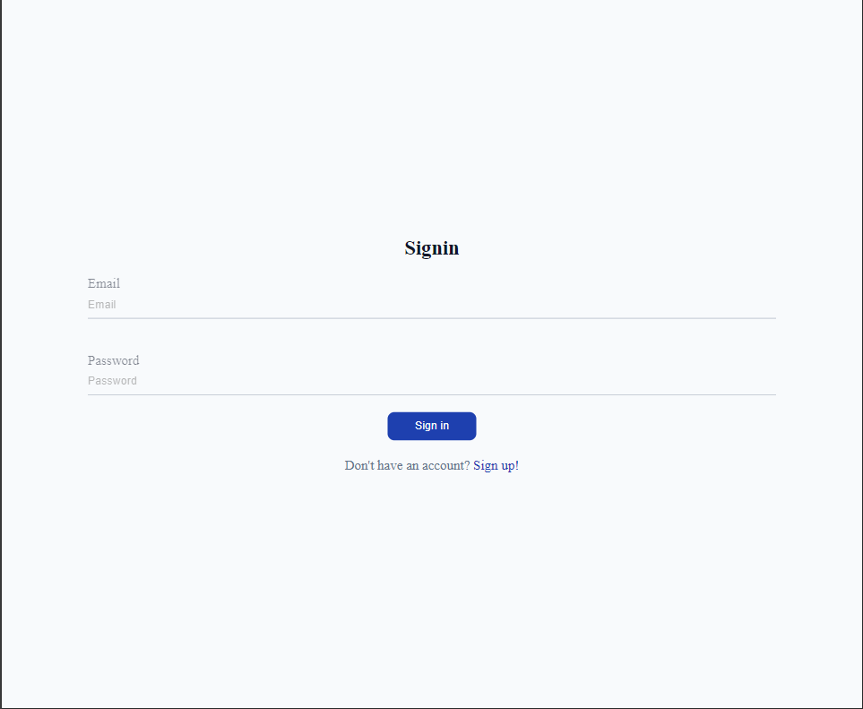
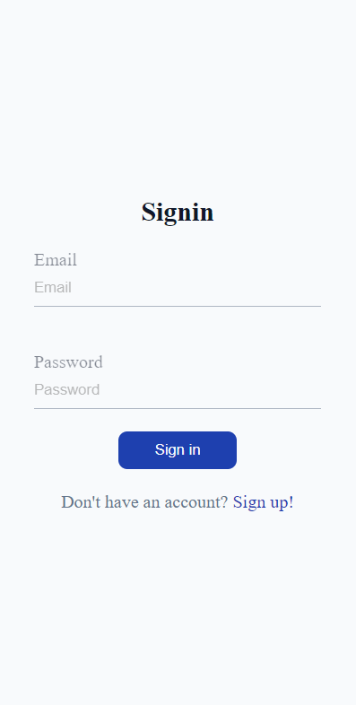
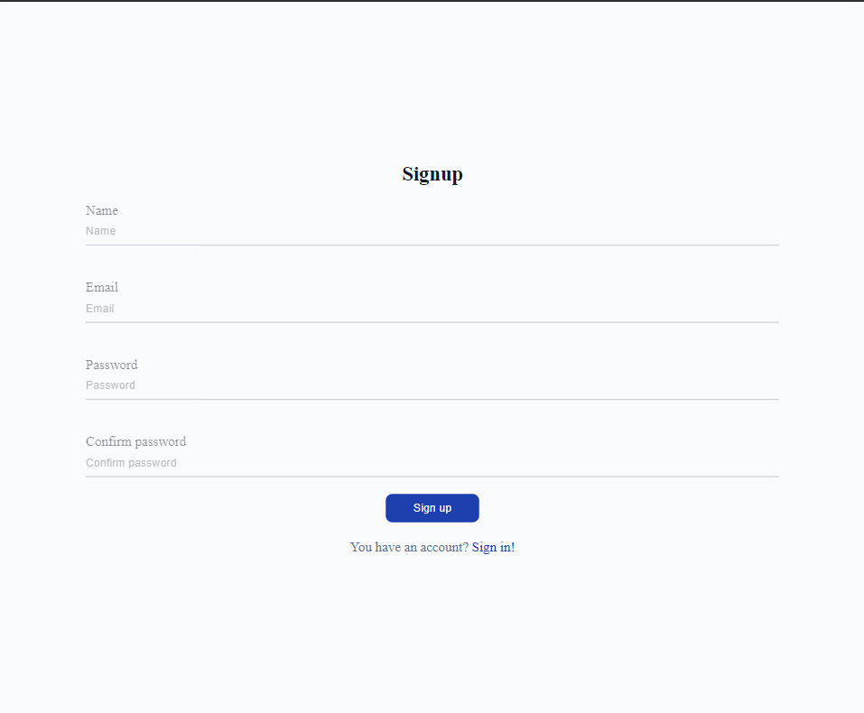
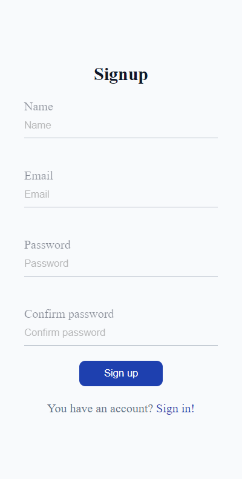
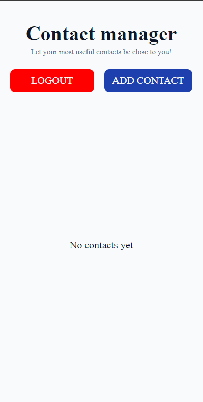
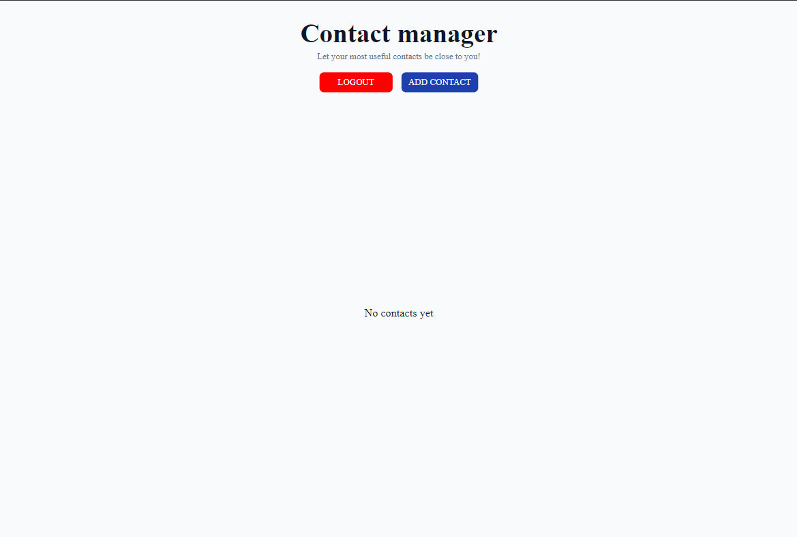
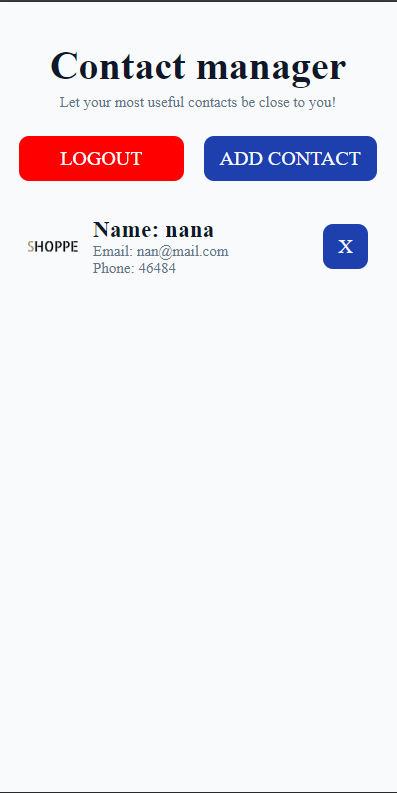
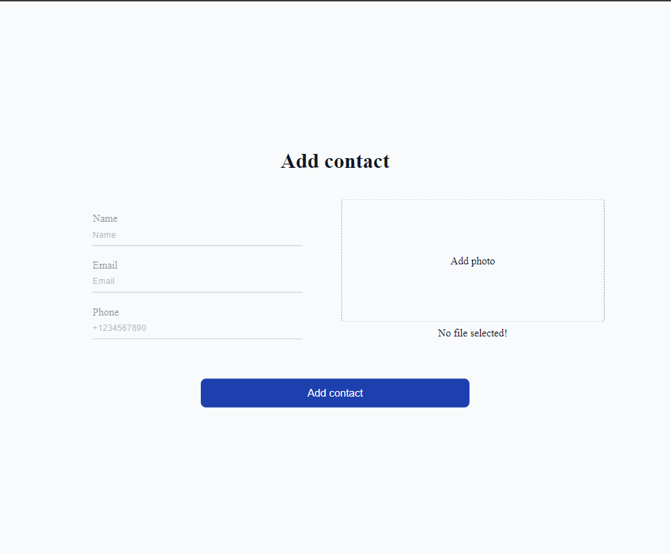

# php-contact-mananger

## Demo

https://php-contact-mananger.wasmer.app/

## About
This is pet-project to learn PHP. It is basic CRM-project. User should log in and add contacts with name, email and phone number as required fields and photo as optional. Then user can add next contact or delete contact that was in a list.

## Tech-stack
- HTML
- CSS
- JS
- PHP
- Cloudinary

## How to run
```bash
    php -S localhost:8080 -t public
```

## Sreenshots

### Auth page






### Main page






### Add marker modal


